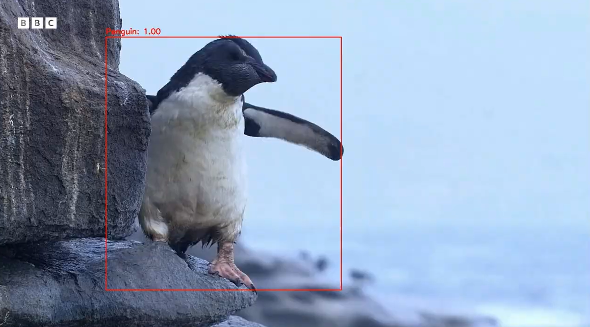
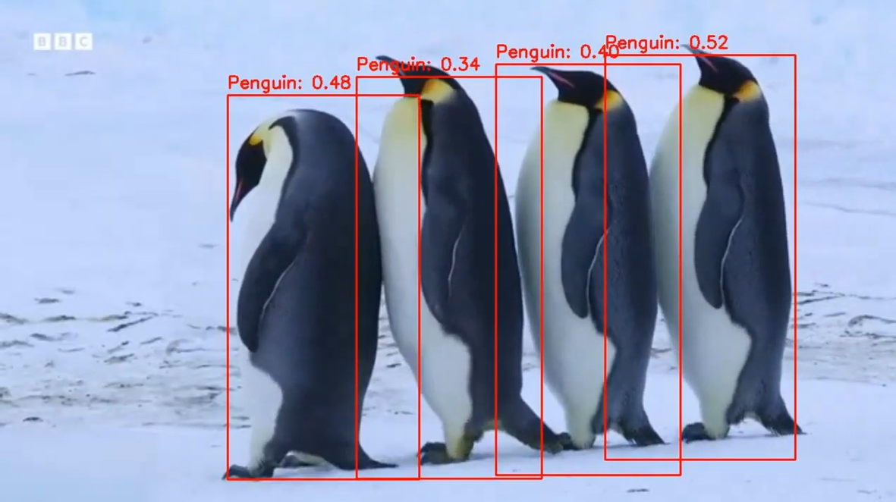
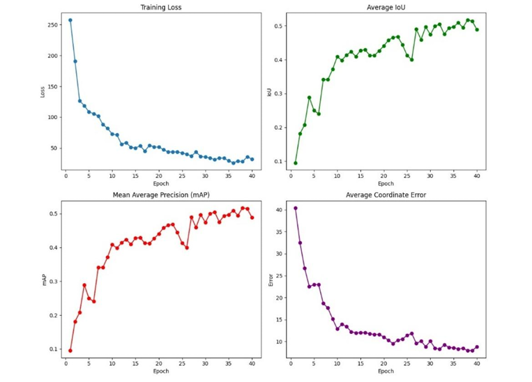
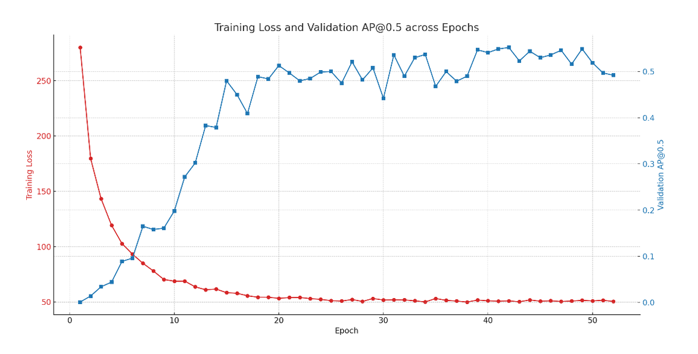

# Object Localization with fine-tuning ResNet-18 - Neural Networks

## Overview

Fine-tuned a custom ResNet-18 backbone for object localization in video frames, implementing 
the full pipeline without using pre-built models like YOLO.

## Project Structure 

### **Python Scripts**
- **`single_object_dectection.py`** 
- **`multi_object_dectection.py`** 

##  Demo

[Demo video – Single Object Dectection](https://drive.google.com/file/d/1T6aOgR3NPZOHFWKU_2KDoeoEX4RFyfCX/view)  

[Demo video – Multi Object Dectection](https://drive.google.com/file/d/1prqulbLfjIk8uoBSdimOPNMfHgkEMz78/view)

## Results
### Training Single Object

### Training Multi Object

## Technical Overview

- **Backbone**: ResNet-18 with last layer removed
- **Heads**: Conv2D for objectness and bbox predictions
- **Losses**: 
  CrossEntropy for classification (Penguin vs Background)
  Smooth L1 for bounding box regression
- **Anchors**: Sizes: [32x32, 64x64, 96x96]
- **Decoding**: Sigmoid + NMS

## Acknowledgments

- Dataset: [Roboflow Penguins Dataset](https://roboflow.com/)
- Based on PyTorch torchvision models